# Vacuum Control for John — MRI Interlock System

A pressure-monitoring and safety-interlock control program for an MRI vacuum
system. An Arduino Mega 2560 runs the safety logic in hardware-adjacent
firmware (`MRI_INT_SYS`); a Python/PyQt5 desktop app (`App`) connects over
USB serial to display live pressures, control the pumps, and log data.

This document is aimed at a new group member who needs to understand how
the system behaves and how to change interlock setpoints safely. For coding
conventions and integration rules, see [docs/MRI_INTLK_SYS.md](docs/MRI_INTLK_SYS.md).

---

## 1. What the system controls

The hardware is physically **two independent vacuum subsystems** sharing one
Arduino Mega chassis. Group A and Group B never affect each other — a fault,
a start, a stop, or a reset on one group has zero effect on the other:

| | Group A | Group B |
|---|---|---|
| Pumps | TV850i-A, TV850i-B | TV350i-A, TV350i-B |
| Foreline (backing) gauge | Foreline-A | Foreline-B |
| Chamber (UHV/"Hornet") gauge | Hornet/UHV-A | Hornet/UHV-B |

Each pump has its own pump-OK feedback signal; each Hornet gauge is
relay-controlled and can be switched off independently of its group's pumps;
each Foreline gauge is always on, no relay.

The Arduino continuously reads all 4 gauges and all 4 pump-OK signals, runs
the safety interlocks for both groups, and drives the 6 relays (4 pumps + 2
Hornet gauges). It reports everything once a second over serial as one CSV
line covering both groups; the Python app is a passive display/control
client — **all safety logic lives in the firmware**, not in Python. Losing
the serial connection does not shut the system down.

---

## 2. How the firmware state machine works

The firmware runs **two fully independent state machines**, one per group —
literally two instances of the same `StateMachine` class
(`MRI_INT_SYS/StateMachine.h/.cpp`), each constructed with only its own
group's 2 pumps, 1 Hornet relay, 1 foreline gauge, and 1 UHV gauge. Neither
instance holds a reference to anything belonging to the other group. The
only things that aren't fully independent:

- **WARMUP** — each group actually has its *own* warm-up timer, but both are
  started from the same boot timestamp with the same duration, so in
  practice they finish together. This is duplication, not a shared timer.
- **MAINT** — genuinely one shared/global toggle. Entering MAINT bypasses
  *both* groups' interlocks at once for manual per-relay control.

See the full state diagram in [`docs/state_machine.mmd`](docs/state_machine.mmd)
(one generic per-group instance — MAINT is called out separately since it's
the one piece of shared/global state).

### Two independent fault types, evaluated separately per group

- **Hornet-x fault** — Hornet-x's UHV gauge reads above threshold while its
  group is in `RUN` and its Hornet relay is on (after a grace period). Only
  that one Hornet relay turns off; **that group's pumps keep running**, and
  the other group is entirely unaffected. Cleared with `Hx` (or `Rx`).
  While the fault is *not* latched, Hornet-x also stays energized as long as
  **at least one** of that group's two pumps is instantaneously OK — losing
  one pump in a group does not de-energize its Hornet by itself.
- **System-x fault** — Foreline-x over threshold (checked in *every* state
  of group x, not just `RUN`), or either of group x's 2 pump-OK signals
  missing for 15 s while in `RUN`. **Both of group x's pumps and Hornet-x
  turn off.** Cleared with `Rx`, refused while Foreline-x is still above the
  safe-start threshold. Losing a pump-OK signal never commands that pump's
  relay off by itself — the relay stays commanded on until the 15 s timeout
  actually fires the fault.

Each group's fault flags are latched booleans saved to EEPROM independently
of the other group's. One subtlety worth knowing: sending `Xx` (Stop) while
group x is in `FAULT` moves that group's displayed state back to `IDLE`,
but does **not** clear its fault flags — `Sx` (Start) will still be refused
for that group until you actually send `Rx` or `Hx`.

### State persistence

Each group's state, relay outputs, and both fault flags are written to
EEPROM every second and on every change, in a completely separate address
range per group (`MRI_INT_SYS/Config.h`'s `EEPROM_Addr` namespace) — a
power-cycle or EEPROM corruption affecting one group's data can't touch the
other's. MAINT's flag is the one shared/global EEPROM slot. On boot, only
`IDLE`, `RUN`, and `FAULT` are restored per group (with that group's fault
flags cleared for `IDLE`/`RUN`) — this lets you power-cycle the Arduino's
USB connection (e.g. reconnect the GUI) *without* interrupting either
group's running pump sequence, while never resurrecting a transient state
like `START_PUMPS` into something unsafe.

---

## 3. Adjusting interlock setpoints

**All setpoints live in firmware, not in the Python app** — this is
deliberate, so the safety logic keeps working even if the GUI is closed or
the PC is off. To change a setpoint you edit
[`MRI_INT_SYS/Config.h`](MRI_INT_SYS/Config.h) and re-flash the Arduino Mega
with the Arduino IDE (Tools → Board → Arduino Mega 2560, then Upload).

```cpp
namespace Thresholds {
  constexpr float FORELINE_SAFE_START_TORR = 5.0f;  // pumps won't start above this
  constexpr float FORELINE_TRIP_TORR       = 5.0f;  // system fault above this, any state
  constexpr float HORN_TRIP_RISE_TORR      = 7.0e-4f; // hornet fault above this, in RUN
  constexpr float HORN_TRIP_FALL_TORR      = 5.0e-4f; // defined, not currently wired to any logic
}
```

| Constant | Meaning | Used where |
|---|---|---|
| `FORELINE_SAFE_START_TORR` | Foreline-x pressure must be at/below this for **that group's own** pump-start sequence to proceed — Group A gates only on Foreline-A, Group B only on Foreline-B | `START_PUMPS`, per group; also gates `Rx` reset for that group while its system fault is active |
| `FORELINE_TRIP_TORR` | Foreline-x pressure above this triggers a system fault for that group only | Checked every loop, in every state, per group |
| `HORN_TRIP_RISE_TORR` | UHV-x pressure above this triggers that group's Hornet fault | Only checked in `RUN`, after the grace period, per group |
| `HORN_TRIP_FALL_TORR` | Present but **not referenced anywhere in the current logic** — a Hornet fault only clears via the `Hx`/`Rx` commands, not automatically on falling pressure. If you want auto-clear-on-fall behavior, it needs to be wired into `StateMachine::checkSafetyTrips()` | — |

All four thresholds are shared *constants* — there's only one
`FORELINE_TRIP_TORR` in the code — but each group's `StateMachine` instance
evaluates them against its own gauges independently, so there's no way to
set a different threshold for Group A vs Group B without editing the
firmware logic itself (not just the constant).

Other tunables, same file:

```cpp
namespace Timing {
  constexpr uint32_t GAUGE_WARMUP_MS         = 5000UL;   // WARMUP -> IDLE delay at boot, per group
  constexpr uint32_t PUMP_OK_DEBOUNCE_MS     = 2000UL;   // pump OK must be stable this long to count
  constexpr uint32_t FORELINE_STABLE_MS      = 2000UL;   // foreline-safe must be stable this long before pumps start
  constexpr uint32_t PUMP_OK_LOST_TIMEOUT_MS = 15000UL;  // pump OK missing this long in RUN -> system fault
  constexpr uint32_t HORNET_GRACE_PERIOD_MS  = 5000UL;   // delay after a Hornet relay turns on before its fault can trip
  constexpr uint32_t MAINT_ARM_WINDOW_MS     = 5000UL;   // window between the two 'M' taps to enter MAINT
  constexpr uint32_t MAINT_IDLE_TIMEOUT_MS   = 600000UL; // 10 min — MAINT auto-exits and forces outputs off
  constexpr uint32_t CMD_GROUP_TAG_TIMEOUT_MS = 500UL;   // max gap between 'S'/'X'/'R'/'H' and its 'A'/'B' tag (see §5)
}
```

```cpp
namespace Calibration {
  constexpr float TO_GAUGE_8V    = 8.0f / 5.0f;      // voltage-divider scale: Arduino 0-5V domain -> gauge's native 0-8V domain
  constexpr float ADC_CORRECTION = 2.442f / 2.628f;  // corrects a measured Arduino ADC offset (see MRI_INT_SYS.ino header comment)
}
```

Gauge voltage-to-pressure conversion is in `MRI_INT_SYS/Gauge.cpp` (not
`Config.h`, since it's a formula, not a constant):

```
Hornet (UHV):      P(Torr) = 10 ^ (V_gauge - 10)
Stinger (Foreline): P(Torr) = 10 ^ (V_gauge - 5)
```

**Checklist for changing a setpoint:**
1. Edit the constant in `Config.h`.
2. Re-flash the Mega via the Arduino IDE.
3. The Mega reboots — because of EEPROM state restore, each group
   independently comes back in whatever state it was in before the flash
   (e.g. Group A `RUN` with its pumps still relay-commanded on, Group B
   `IDLE`) — double-check pump-OK inputs are actually asserted for any
   group that comes back in `RUN` before trusting that.
4. Confirm the new limit with `?` (status query, reports both groups) or by
   watching the CSV stream — thresholds are not echoed by `?`, so re-open
   `Config.h` if you forget what you set.
5. Do **not** modify `MRI_INT_SYS/` for anything other than a genuine
   hardware/threshold change — see [docs/MRI_INTLK_SYS.md](docs/MRI_INTLK_SYS.md).

---

## 4. Software architecture (Python app)

```mermaid
flowchart LR
    subgraph HW["Hardware"]
        Pumps["4x Turbopumps"]
        UHV["Hornet gauges A/B"]
        Fore["Stinger gauges A/B"]
    end

    subgraph FW["Arduino Mega - MRI_INT_SYS firmware"]
        SM["StateMachine x2 (Group A, Group B): independent interlocks and sequencing"]
        SI["SerialInterface: CSV out, 2-char per-group commands in"]
    end

    HW <--> SM --> SI

    SI <-->|"USB serial, 115200 baud"| SC

    subgraph PY["Python / PyQt5 app"]
        SC["SerialComms.py: ArduinoSerialComms"]
        CH["Channels.py: AppChannels Qt signals"]
        PP["pressure_page.py: gauges, pump controls, chart"]
        MP["maintenance_page.py: manual relay dialog"]
        PL["PressureLogger.py: CSV file logger"]
    end

    SC -- "data_received, connection_changed, error" --> CH
    CH --> PP
    PP --> PL
    PL --> CSV[("Recorded Data/Recorded Pressures/YYYY/MM/*.csv")]
    PP -.opens.-> MP
    PP -- "send_command SA/SB, XA/XB, RA/RB, HA/HB, M, relay chars" --> SC
    MP -- "send_command relay chars" --> SC
```



- **`Services/SerialComms.py`** (`ArduinoSerialComms`) owns the serial port,
  polls it on a `QTimer` (non-blocking), parses each `ms: ...` CSV line, and
  emits Qt signals. It never touches widgets.
- **`Services/Channels.py`** (`AppChannels`) is the signal bus connecting
  the serial layer to the GUI: `data_received(dict)`,
  `connection_changed(bool, str)`, `error(str)`, `command_sent(str)`.
- **`Pages/pressure_page.py`** is the main GUI: 4 gauge widgets, two
  side-by-side Group A / Group B panels (each with its own state label,
  fault label, status-only pump widgets, and Startup/Shutdown/Hornet-reset/
  Reset-all buttons wired to that group's two-character commands), a
  `pyqtgraph` chart with a time-window selector, and the connect/disconnect
  controls. The 4 pump widgets are display-only — starting/stopping is
  always a per-group action, there's no such thing as starting a single
  pump. The page reads from the CSV logs *and* the in-memory deque to plot
  windows longer than what's held in memory (12 hours at 1 Hz ≈ 43,200
  samples).
- **`Pages/maintenance_page.py`** is a manual relay-control dialog — only
  usable once the firmware confirms MAINT mode is active (see §2).
- **`Services/PressureLogger.py`** writes two CSVs per day (UHV, Foreline)
  under `Recorded Data/Recorded Pressures/YYYY/MM/`, rotating at 3:00 AM.
  Foreline rows are throttled to one write per 10 s; UHV rows are written
  every received sample.

The GUI never talks to the serial port directly, and the serial/logging
layers never touch Qt widgets — see the "Integration rules" in
[docs/MRI_INTLK_SYS.md](docs/MRI_INTLK_SYS.md) if you're adding a channel or a page.

---

## 5. Serial protocol reference

One CSV line per second, always starting with `ms: ` (anything else —
startup banner, help text — is ignored by the parser). Note `stateA`/
`stateB` and the `fault_*A`/`fault_*B` columns identify the **interlock
group**, while the `_A`/`_B` on `tv850i*`/`tv350i*`/`rel_tv850i*`/
`rel_tv350i*` columns identify the **pump sub-unit within a group** — these
two axes coincide on this hardware (both TV850i pumps are in Group A, both
TV350i pumps in Group B) but are conceptually different:

```
ms: 12345, uhvV_A: 1.2345, uhvV_B: 1.2345, foreV_A: 1.2345, foreV_B: 1.2345,
uhvTorr_A: 1.23e-07, uhvTorr_B: 1.23e-07, foreTorr_A: 1.23e-02, foreTorr_B: 1.23e-02,
stateA: RUN, stateB: IDLE, tv850iA_ok: OK, tv850iB_ok: OK, tv350iA_ok: OK, tv350iB_ok: NO,
rel_tv850iA: 1, rel_tv850iB: 1, rel_tv350iA: 0, rel_tv350iB: 0,
rel_hornetA: 1, rel_hornetB: 0, fault_hornetA: 0, fault_systemA: 0,
fault_hornetB: 0, fault_systemB: 0, maint: 0
```

### Commands

Start/Stop/Reset/Hornet-reset are **two characters**: the base command
letter plus a group tag (`A` or `B`), e.g. `SA` starts Group A. The firmware
buffers the first character and waits up to 500 ms
(`Timing::CMD_GROUP_TAG_TIMEOUT_MS`) for the tag; an invalid or missing tag
silently drops the command rather than misfiring — this is deliberate
fail-closed behavior for safety-critical firmware, so if a command seems to
do nothing, just resend both characters together. `?`, `M`, and all MAINT
relay characters are unchanged, single-character, and group-agnostic.

| Command | Action | Char | Action |
|---|---|---|---|
| `SA` / `SB` | Start sequence, Group A / B | `A` / `B` | Hornet-A relay ON / OFF *(MAINT only)* |
| `XA` / `XB` | Shutdown / stop, Group A / B | `C` / `D` | Hornet-B relay ON / OFF *(MAINT only)* |
| `RA` / `RB` | Reset all faults, Group A / B | `1` / `2` | TV850i-A relay ON / OFF *(MAINT only)* |
| `HA` / `HB` | Reset Hornet fault only, Group A / B | `3` / `4` | TV850i-B relay ON / OFF *(MAINT only)* |
| `?` | Status query (reports both groups) | `5` / `6` | TV350i-A relay ON / OFF *(MAINT only)* |
| `M` | Maintenance toggle (send twice within 5 s, shared/global) | `7` / `8` | TV350i-B relay ON / OFF *(MAINT only)* |
| | | `0` | All relays OFF *(MAINT only)* |

---

## 6. Running the app

```bash
pip install -r App/requirements.txt
python App/main.py
```

1. Select the Arduino's COM port and click **Connect** (DTR is disabled on
   open so the Mega doesn't reset and lose its EEPROM-restored state).
2. Group A and Group B each have their own **STARTUP** / **SHUTDOWN**
   buttons for normal sequencing, and their own **CLEAR HORNET FAULT** /
   **RESET ALL** buttons after a trip — operating one group has no effect
   on the other. The 4 pump status widgets are display-only.
3. **MAINTENANCE** opens the manual relay dialog — only usable for
   bench testing, never during normal operation (it bypasses every
   interlock in this document, for both groups at once).

---

## 7. Repository map

```text
App/                  PyQt5 entry point, requirements.txt
MRI_INT_SYS/           Arduino Mega firmware — source of truth for interlocks
  Config.h             pins, timing, thresholds, calibration, per-group EEPROM addresses (§3)
  StateMachine.h/.cpp   ONE class, instantiated twice (groupA/groupB in the .ino) — state + safety trips (§2)
  Gauge.h/.cpp          ADC read, filtering, volts->Torr conversion
  Pump.h                pump-OK debounce/timeout, already independent per pump
  SerialInterface.h/.cpp CSV output + 2-char per-group command parsing (§5)
  MaintenanceMode.h/.cpp two-tap MAINT arm/disarm/timeout, shared/global
  StateManager.h/.cpp    per-group EEPROM persistence + shared MAINT-mode flag
Pages/                 pressure_page.py (main GUI, two group panels), maintenance_page.py
Services/               SerialComms.py, Channels.py, PressureLogger.py, CustomWidgets.py
UI/theme.py             color themes
Tests/                  quick_check.py, test_graph_display.py, test_serial.py
docs/state_machine.mmd  standalone copy of the diagram in §2
Recorded Data/          CSV output from PressureLogger, organized by year/month
```

For coding conventions and integration rules, see docs/MRI_INTLK_SYS.md
